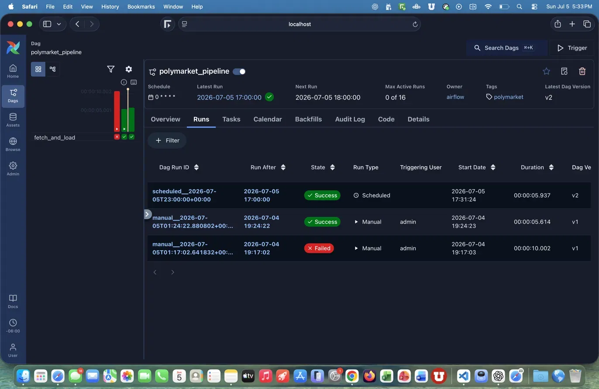
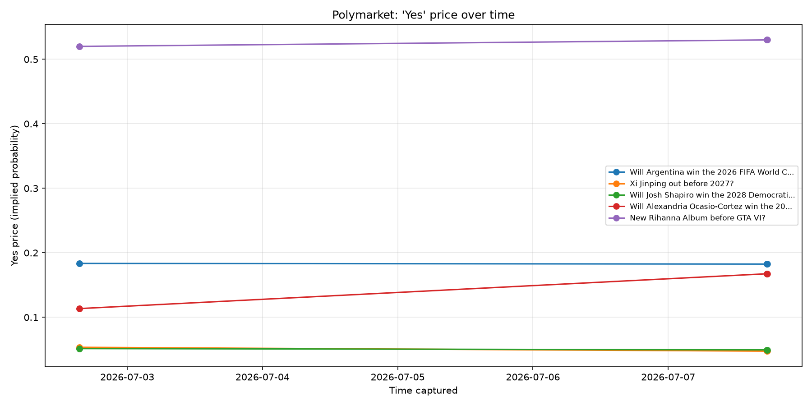

# Polymarket Data Pipeline

An end-to-end ELT data pipeline that collects live prediction-market data from Polymarket, transforms it into analytics-ready tables, and runs automatically on an hourly schedule to build a time-series history that the public API does not provide.

## Why This Project

The Polymarket API only returns the current state of each market — there is no historical price endpoint. By capturing a snapshot every hour, this pipeline builds its own history of how market-implied probabilities move over time.

## Architecture

```
Polymarket API
      |  (Python + pandas)
      v
  Clean & transform
      |
      v
  DuckDB warehouse   <- hourly snapshots stack here
      |  (dbt models)
      v
  Analytics tables (latest_prices, price_changes)
      |
      v
  Matplotlib visualization
```

The full fetch -> clean -> load flow is orchestrated by an Apache Airflow DAG scheduled to run every hour.



## Tech Stack

- **Python / pandas** — fetch and clean the API data
- **DuckDB** — local analytical warehouse storing hourly snapshots
- **dbt** — SQL transformations into modeled tables (window functions to dedupe snapshots and compute price movement)
- **Apache Airflow** — orchestrates and schedules the pipeline hourly
- **Matplotlib** — visualizes price trends over time

## How It Works

1. `src/fetch.py` pulls ~50 active markets from the Polymarket API, cleans the data with pandas, and appends a timestamped snapshot to DuckDB.
2. `polymarket_dbt/` contains dbt models that transform the raw snapshots into `latest_prices` (current price per market) and `price_changes` (price movement over time).
3. `airflow/dags/polymarket_dag.py` runs the whole pipeline automatically every hour.
4. `analysis/plot_prices.py` charts how market probabilities have shifted across snapshots.



## Project Structure

```
polymarket-pipeline/
├── src/
│   └── fetch.py               # fetch + clean + load into DuckDB
├── polymarket_dbt/
│   └── models/                # dbt transformation models
├── airflow/
│   └── dags/
│       └── polymarket_dag.py  # Airflow DAG (hourly schedule)
├── analysis/
│   └── plot_prices.py         # matplotlib visualization
└── README.md
```

## Running It Locally

```bash
# install dependencies
pip install requests pandas duckdb matplotlib

# run the pipeline once
python src/fetch.py

# build the dbt models
cd polymarket_dbt && dbt run

# generate the price chart
python analysis/plot_prices.py
```

To run the pipeline on a schedule, start Airflow and enable the `polymarket_pipeline` DAG:

```bash
airflow standalone
```

## What I Learned

Built a complete data engineering workflow from scratch — API ingestion, warehousing in DuckDB, SQL data modeling with dbt, and pipeline orchestration and scheduling with Apache Airflow.
