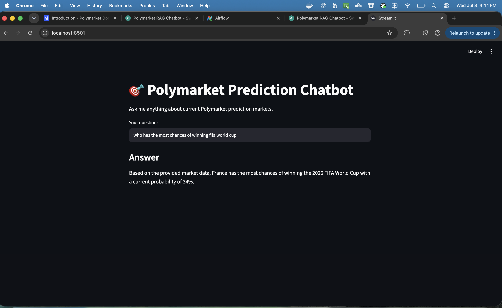

# Polymarket Data & AI Engineering Project

An end-to-end system that collects live prediction-market data through an automated data pipeline, then answers natural-language questions about it using a Retrieval-Augmented Generation (RAG) AI chatbot.

This repo contains **two connected projects**:
- **Part 1 — a data pipeline** that ingests, transforms, and schedules Polymarket data.
- **Part 2 — a RAG chatbot** that lets you ask questions about that data in plain English.

The pipeline feeds the chatbot: the cleaned `latest_prices` table built by the pipeline is the exact data the chatbot answers from.

```
Polymarket API
      |
      v
  Data Pipeline  (Part 1)  ---->  DuckDB warehouse  ---->  RAG Chatbot  (Part 2)
  Python, dbt, Airflow             (latest_prices)         Chroma, Gemini, FastAPI
```

---

# Part 1 — The Data Pipeline

An end-to-end ELT data pipeline that collects live prediction-market data from Polymarket, transforms it into analytics-ready tables, and runs automatically on an hourly schedule to build a time-series history that the public API does not provide.

## Why This Project
The Polymarket API only returns the current state of each market — there is no historical price endpoint. By capturing a snapshot every hour, this pipeline builds its own history of how market-implied probabilities move over time.

## Architecture
```
Polymarket API
      |  (Python + pandas)
      v
  Clean & transform
      |
      v
  DuckDB warehouse   <- hourly snapshots stack here
      |  (dbt models)
      v
  Analytics tables (latest_prices, price_changes)
      |
      v
  Matplotlib visualization
```
The full fetch -> clean -> load flow is orchestrated by an Apache Airflow DAG scheduled to run every hour.


## Tech Stack
- **Python / pandas** — fetch and clean the API data
- **DuckDB** — local analytical warehouse storing hourly snapshots
- **dbt** — SQL transformations into modeled tables (window functions to dedupe snapshots and compute price movement)
- **Apache Airflow** — orchestrates and schedules the pipeline hourly
- **Matplotlib** — visualizes price trends over time

## How It Works
1. `src/fetch.py` pulls active markets from the Polymarket API (paginated), cleans the data with pandas, and appends a timestamped snapshot to DuckDB.
2. `polymarket_dbt/` contains dbt models that transform the raw snapshots into `latest_prices` (current price per market) and `price_changes` (price movement over time).
3. `airflow/dags/polymarket_dag.py` runs the whole pipeline automatically every hour.
4. `analysis/plot_prices.py` charts how market probabilities have shifted across snapshots.


## Running It Locally
```bash
# install dependencies
pip install requests pandas duckdb matplotlib

# run the pipeline once
python src/fetch.py

# build the dbt models
cd polymarket_dbt && dbt run

# generate the price chart
python analysis/plot_prices.py
```
To run the pipeline on a schedule, start Airflow and enable the `polymarket_pipeline` DAG:
```bash
airflow standalone
```

---

# Part 2 — The RAG Chatbot

A Retrieval-Augmented Generation chatbot that answers natural-language questions about the Polymarket data collected in Part 1 — for example, "what markets are about crypto?" or "which team is most likely to win the World Cup?"

## How RAG Works Here
The AI model (Gemini) knows nothing about this specific Polymarket data. So instead of asking it directly, the app first **retrieves** the most relevant markets from a vector database, then hands those to Gemini to **generate** a grounded answer:

```
Market text  ->  embeddings  ->  Chroma vector database   (stored once)

Question  ->  find closest markets  ->  Gemini answers using them  ->  served via FastAPI
```

Because retrieval matches by *meaning* (not keywords), asking about "crypto" correctly surfaces Bitcoin markets even though they never use the word "crypto."



## Tech Stack
- **sentence-transformers** — turns market text into embeddings (free, runs locally)
- **Chroma** — vector database storing the embeddings for semantic search
- **Google Gemini** — the LLM that generates grounded answers (free API tier)
- **FastAPI** — serves the chatbot behind a `POST /ask` endpoint
- **Streamlit** — a simple chat interface for interacting with the bot
- **Docker** — containerizes the app so it runs anywhere

## How It Works
1. `src/ingest.py` reads the cleaned markets from DuckDB, turns each into a rich text chunk (question + probability + volume), embeds them, and stores them in Chroma.
2. `src/rag.py` is the RAG engine: it retrieves the most relevant markets for a question and asks Gemini to answer using only those.
3. `src/main.py` serves the engine as a FastAPI endpoint.
4. `src/app.py` provides a Streamlit chat interface for a friendly UI.
5. A `Dockerfile` packages the whole app into a container.

## Running It Locally
```bash
# install dependencies
pip install chromadb sentence-transformers google-genai python-dotenv fastapi uvicorn streamlit

# 1. load the market data into the Chroma vector database
python src/ingest.py

# 2a. run the chat interface (recommended for a demo)
cd src && streamlit run app.py

# 2b. OR run the API directly
cd src && uvicorn main:app --reload
```
A free Gemini API key (from Google AI Studio) is required. Store it in a `.env` file as `GEMINI_API_KEY=your_key` — it is never committed to the repo.

## Running with Docker
```bash
docker build -t polymarket-rag .
docker run -p 8000:8000 --env-file .env polymarket-rag
```
Then open `http://localhost:8000/docs` to use the API.

---

## Project Structure
```
polymarket-pipeline/
├── src/
│   ├── fetch.py               # fetch + clean + load into DuckDB
│   ├── ingest.py              # embed markets into Chroma
│   ├── rag.py                 # RAG engine: retrieve + generate
│   ├── main.py                # FastAPI endpoint
│   └── app.py                 # Streamlit chat interface
├── polymarket_dbt/
│   └── models/                # dbt transformation models
├── airflow/
│   └── dags/
│       └── polymarket_dag.py  # Airflow DAG (hourly schedule)
├── analysis/
│   └── plot_prices.py         # matplotlib visualization
├── Dockerfile                 # containerizes the chatbot
├── requirements.txt
└── README.md
```

## What I Built
A complete Data & AI Engineering system from scratch:
- **Data engineering** — API ingestion, warehousing in DuckDB, SQL data modeling with dbt, and hourly pipeline orchestration with Apache Airflow.
- **AI engineering** — a RAG pipeline with semantic search (embeddings + Chroma vector database), grounded answer generation with an LLM, served via a FastAPI endpoint and a Streamlit UI, all containerized with Docker.
